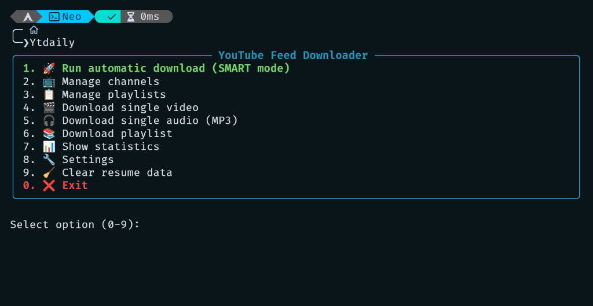
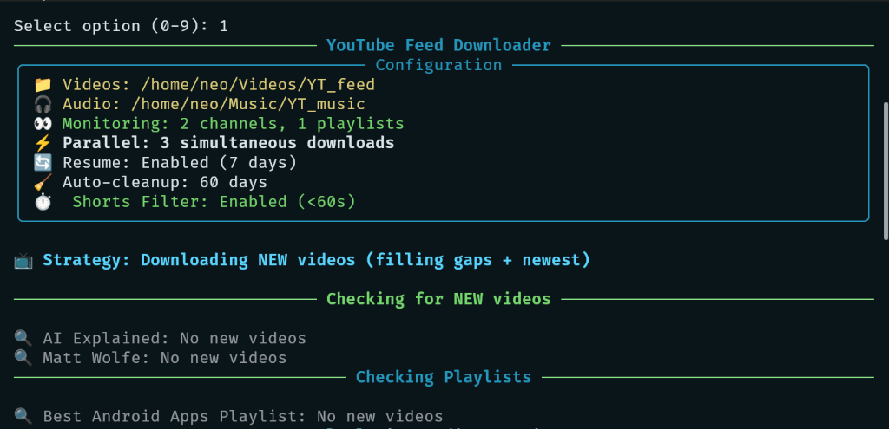

# 📺 yt-daily
[](http://unlicense.org/)
[](https://www.python.org/downloads/)
[](https://www.kernel.org/)

**yt-daily** is a high-performance, interactive YouTube automation engine designed for creators and enthusiasts. It transforms your local machine into a smart media server that monitors your favorite channels and playlists, downloading content in crystal-clear quality while applying professional-grade filtering and optimization.

---

## 🖼️ Visual Tour

### 🖥️ Core Interface
| Main Menu | Statistics Dashboard |
| :---: | :---: |
|  |  |

### 🚀 Smart Tracking & Downloads
| Configuration Scan | Scan Results |
| :---: | :---: |
|  |  |

### ⚡ Advanced Features
| Parallel Download Progress | Detailed Download Info |
| :---: | :---: |
|  |  |

| Customizable Settings | Playlist Management |
| :---: | :---: |
|  |  |

---

## 🛠️ How it Works: The Architecture

`yt-daily` is built on a "Silent Automation" philosophy. It uses a **State-Based Tracking System** to ensure you never miss a video and never download a duplicate.

### 1. The Intelligent Monitor
The engine maintains a local JSON database of every video it has ever encountered. When a scan starts, it fetches the latest activity from your monitored channels and compares signatures to identify "Gaps" in your collection.

### 2. Parallel Processing Engine
Unlike traditional downloaders that process one file at a time, `yt-daily` utilizes a multi-threaded parallel downloader. It intelligently distributes your bandwidth across multiple streams to finish your daily queue in minutes rather than hours.

### 3. The SponsorBlock Integration
Every download is automatically scrubbed of non-content segments (Sponsors, Intros, Outros, Interaction Reminders) using the SponsorBlock API, saving you hours of watch time.

---

## 🚀 One-Click Installation

Designed to work across **Arch, Debian, Ubuntu, and Fedora** based distributions. The installer handles system dependencies, Python environment isolation (PEP 668), and shell integration.

```bash
git clone https://github.com/DevXtechnic/yt-daily.git
cd yt-daily
chmod +x install.sh
./install.sh
```

### What the installer does:
- Checks for and installs `yt-dlp`, `ffmpeg`, and `python-rich` using your native package manager.
- Sets up a robust directory structure in `~/.local/share/yt-daily/`.
- Injects `Ytdaily` aliases into your shell (`bash`, `zsh`, or `fish`).
- **Initializes the Automation Engine (Systemd).**

---

## ⏰ The Automation Engine (Systemd)

After installation, `yt-daily` operates as a silent background service. 

- **Trigger**: The service runs once every 24 hours.
- **Boot Safety**: It includes a **5-minute delay** after your system boots to ensure network stability before starting the scan.
- **Resource Management**: Uses `Nice=19` and `IOSchedulingClass=idle` to ensure it never slows down your PC while you are working.

You can check the status of your automated downloader at any time:
```bash
systemctl --user status Ytdaily.service
```

---

## ✨ Key Features

- 🎯 **Multi-Quality Support**: Target any resolution from 360p to 4K (2160p).
- 📻 **Podcast Automation**: Automatically converts specific sources to high-fidelity 320kbps MP3s.
- 🧹 **Dynamic Cleanup**: Set a retention policy (e.g., 60 days) to keep your storage lean.
- 🌍 **Subtitles & Metadata**: Embeds official and auto-generated subtitles, thumbnails, and metadata into the MP4 container.

---

## 📜 Technical Stack

- **Logic**: Python 3
- **UI**: Rich TUI Framework
- **Engine**: yt-dlp & FFmpeg
- **Scheduling**: Systemd User Timers
- **Package Management**: Native Linux Bridge (Pacman/Apt/Dnf)

---

## ⚖️ License

[Unlicense](LICENSE) (Public Domain) - Free to use, modify, and distribute for any purpose.
